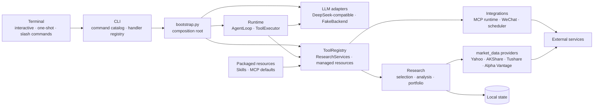

<div align="center">

# TickerDossier

**证据优先、边界清晰的终端股票研究助手**

把行情、基本面、新闻、反证与风险检查组织成可追溯的研究档案，面向 A 股、港股和美股，支持纸面组合、MCP / Skill 扩展与本地优先的工作流。

[](pyproject.toml)
[](https://github.com/nixiakT/ticker-dossier/actions/workflows/ci.yml)
[](LICENSE)

[English](README_EN.md) · [快速开始](#快速开始) · [能力](#核心能力) · [架构](docs/ARCHITECTURE.md)

</div>

> [!CAUTION]
> TickerDossier 只用于研究辅助和纸面组合实验：不连接券商、不执行真实交易，也不构成投资建议。

## 十秒体验

```bash
ticker-dossier /quote AAPL
ticker-dossier /quality AAPL 1y
ticker-dossier "比较 NVDA 和 AMD 的基本面、近期走势与主要风险"
```

前两个 slash command 是可重复的确定性入口；自然语言任务由 Agent 循环协调模型与工具。没有模型密钥时仍可运行自检、帮助和离线后端。

## 核心能力

| | 能力 | 你得到什么 |
| --- | --- | --- |
| 🔎 | **证据化研究** | 行情、历史价格、基本面与新闻，并保留来源、时间戳、覆盖率和数据缺口。 |
| 📊 | **结构化分析** | 技术指标、质量门禁、研究档案、标的对比、多视角审查和均线策略回测。 |
| 🧪 | **纸面实验** | 预测记账与到期评分、模拟持仓、只读最新估值和交易流水；始终不触达真实券商。 |
| 🧩 | **可扩展运行时** | ReAct 工具循环、MCP、Skills、记忆、确认机制，以及无密钥时的 `FakeBackend`。 |

Provider 可用性取决于网络、凭据和上游服务。TickerDossier 会明确标记样例回退、冲突字段与缺失数据，不用模型猜测补数。

## 快速开始

```bash
git clone https://github.com/nixiakT/ticker-dossier.git
cd ticker-dossier

python3.11 -m venv .venv
source .venv/bin/activate
python -m pip install --upgrade pip
python -m pip install -e .

cp .env.example .env.local
ticker-dossier --selfcheck
ticker-dossier /help
```

安装 A 股、港股和美股的可选数据 Provider：

```bash
python -m pip install -e ".[providers]"
```

安装包内置只读的 Skills 与默认 MCP 配置；项目目录中的 `skills/` 和 `.mcp.json` 可按需覆盖，因此 wheel 在仓库外也能自检和运行。

需要模型驱动的自然语言研究时，在 `.env.local` 中配置 `DEEPSEEK_API_KEY`。项目使用 OpenAI-compatible API；未配置时自动回退到离线后端，不发起付费请求。

> `ticker-dossier` 是新的主命令；旧的 `finance-agent` 命令保留为兼容别名。

## 常见工作流

```bash
# 行情、基本面、新闻与结构化研究
ticker-dossier /quote AAPL
ticker-dossier /financials AAPL
ticker-dossier /news AAPL 5
ticker-dossier /report AAPL 1y

# 多标的对比与审查
ticker-dossier /compare NVDA AMD 1y
ticker-dossier /debate NVDA AMD 1y
ticker-dossier /backtest TSLA 20 60 2y

# 一次性只读终端快照（默认或指定纸面账户）
ticker-dossier --dashboard
ticker-dossier /dashboard
ticker-dossier /dashboard --account growth

# 只会写入纸面记录，不会真实下单
ticker-dossier /portfolio init 100000 AAPL MSFT NVDA
ticker-dossier /portfolio locate default
ticker-dossier /portfolio review
ticker-dossier /predict list
```

`--dashboard` 与 `/dashboard [--account name]` 显示一次性只读终端快照，包括运行状态、默认或指定纸面组合及其持仓。快照只使用账本中已保存的价格：不会联网刷新行情、不会自动执行 `mark`、不会写入任何文件，也不代表券商中的真实持仓。若发现同名账户位置冲突，快照会提示冲突，但不会迁移账户。

`/portfolio review` 用最新可得行情在内存中估值，不写回账本；旧 workspace 账户可在核对位置和备份后用 `/portfolio migrate default` 显式迁移，目标已存在时会拒绝覆盖或合并。

## 安全边界

| TickerDossier 会做 | TickerDossier 不会做 |
| --- | --- |
| 展示来源、时间、数据缺口和相互冲突的证据 | 把缺失字段用模型常识或无来源数字补齐 |
| 在工作区内执行受限文件与 shell 操作 | 连接券商、提交订单或声称真实成交 |
| 将网页、新闻、记忆和 MCP 输出视为不可信数据 | 让外部文本覆盖系统策略或权限检查 |
| 在 `dry-run` 模式写入本地消息 outbox | 未经确认向 webhook / relay 外发内容 |

- 文件工具拒绝 `.git`、`.env`、凭据目录、越界路径和疑似 secret 写入。
- shell 只接受受限单命令；危险 Git、控制符、管道和重定向会被拒绝或要求确认。
- 非内置 MCP server 必须通过绑定完整配置的信任指纹；子进程只继承最小环境。
- 这是应用层防护，不是完整操作系统沙箱。没有 `bubblewrap` 时，获批子进程仍拥有当前用户权限。

完整威胁边界见 [架构文档](docs/ARCHITECTURE.md#安全边界)。

## 架构



`bootstrap.py` 创建单一 `ResearchServices` 并放入 `ToolRegistry`，CLI 与 Tool 适配器复用同一个研究服务。`runtime.execution` 统一处理权限、复用回执和副作用边界；行情模型、Provider、缓存与多源编排集中在 `market_data`，模型后端与 MCP 等外部适配器集中在 `integrations`。应用创建的资源由 composition root 和 `ToolRegistry` 统一关闭。

```text
src/ticker_dossier/
├── cli/
│   ├── commands/        # catalog、router 与按能力分组的 handlers
│   └── terminal/        # 输入、Dashboard 与终端渲染
├── runtime/             # Agent 循环、执行器、上下文、权限与契约
├── market_data/
│   └── providers/       # 行情模型、多源编排和具体数据 Provider
├── research/
│   ├── analysis/        # 指标、质量门禁、框架与回测
│   ├── debate/          # 规则回退和模型辩论
│   ├── discovery/       # 标的解析与网页核验
│   └── learning/        # 记忆、历史校准与预测评估
├── portfolio/           # 纸面组合模型、评分、渲染与安全存储
├── integrations/
│   ├── llm/             # 真实模型与离线模型后端
│   └── mcp/             # MCP 配置、传输与生命周期
├── tools/               # Agent Tool 适配器
├── skills/              # Skill 加载和生成逻辑
├── resources/           # wheel 内置 Skills 与 MCP 默认配置
└── bootstrap.py         # composition root
```

设计约束、状态迁移和已知技术债见 [docs/ARCHITECTURE.md](docs/ARCHITECTURE.md)。

<details>
<summary><strong>常用命令</strong></summary>

| 命令 | 用途 |
| --- | --- |
| `/help`、`/status`、`/selfcheck` | 帮助、运行状态与环境自检 |
| `/resolve Apple`、`/quote AAPL` | 解析证券并查询行情快照 |
| `/history AAPL 1y`、`/indicators AAPL 1y` | 历史行情与技术指标 |
| `/financials AAPL`、`/news AAPL 5` | 基本面与相关新闻 |
| `/quality AAPL 1y`、`/report AAPL 1y` | 质量门禁与研究档案 |
| `/compare NVDA AMD 1y`、`/debate NVDA AMD 1y` | 同口径对比与多视角审查 |
| `--dashboard`、`/dashboard [--account name]` | 一次性只读运行状态与纸面持仓快照 |
| `/portfolio status\|review\|locate\|migrate`、`/predict list` | 纸面组合、位置迁移与预测账本 |
| `/skills`、`/mcp`、`/tools` | 扩展能力与工具诊断 |
| `/trace on\|off`、`/trace` | 执行轨迹控制与回看 |
| `/schedule list`、`/wechat status` | 本地任务与消息连接状态 |

统一 command catalog 同时驱动路由、帮助和模糊补全，并在启动时校验 handler registry；项目命令、Skills 与 MCP prompts 会在运行时合并进入菜单。

</details>

<details>
<summary><strong>配置与本地状态</strong></summary>

配置按“现有环境变量 → `.env.local` → `.env`”读取，真实密钥只应放在 Git 忽略的本地文件中。

| 变量 | 作用 |
| --- | --- |
| `DEEPSEEK_API_KEY` | 启用真实模型后端 |
| `DEEPSEEK_BASE_URL`、`DEEPSEEK_MODEL` | 模型端点和模型名 |
| `TICKER_DOSSIER_LANG` | CLI 语言：`zh` 或 `en` |
| `FINANCE_HTTP_PROXY` | 网页与行情请求代理 |
| `TUSHARE_TOKEN`、`ALPHAVANTAGE_API_KEY` | 启用对应数据源 |
| `FINANCE_ALLOW_SAMPLE_FALLBACK` | 显式允许样例数据回退，默认关闭 |
| `FINANCE_PREDICTION_PATH`、`FINANCE_PORTFOLIO_DIR` | 覆盖预测与纸面组合路径 |
| `FINANCE_WECHAT_MODE` | `dry-run`、`webhook` 或 `relay` |
| `TICKER_DOSSIER_APPROVED_TOOLS` | 按名称批准确认类工具 |
| `TICKER_DOSSIER_AUTO_APPROVE` | 仅自动批准受限的本地 Python 入口 |
| `TICKER_DOSSIER_TRUSTED_MCP_SERVERS` | 信任已审查 MCP 配置的指纹 |

为避免升级时丢失用户数据，现有 `.finance_agent/`、`~/.finance-agent/`、`FINANCE_AGENT_LANG` 和 `MINI_OPENCLAW_*` 位置/变量继续兼容。完整示例见 [.env.example](.env.example)。

若用户级与 workspace 中存在两份同名纸面账户，只读命令会显示冲突并优先展示用户级文件，所有写操作都会锁定，直到用户人工核对并消除冲突。

</details>

## 开发

```bash
python -m pip install -e ".[dev,providers]"
python -m ruff check src tests evals scripts
python scripts/ci/check_complexity.py
python -m pytest -q
python -m mypy
python -m compileall -q src/ticker_dossier evals tests scripts
python -m ticker_dossier --selfcheck
python -m build
```

CI 覆盖 Ubuntu Python 3.11/3.12/3.13 与 Windows Python 3.13，并执行 Ruff、复杂度门禁、strict mypy、依赖方向测试，以及仓库外 wheel 安装/资源自检。相同的质量命令可以直接在本地运行，不在 workflow 中维护第二份文件清单。评估工具位于 `evals/`，可版本化项目 Skills 位于 `skills/`；提交前请确认没有加入凭据、个人状态或生成目录。

## License

[MIT](LICENSE)
