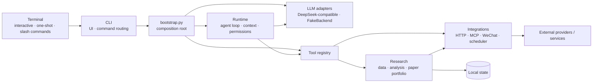

<div align="center">

# TickerDossier

**Evidence-first stock research, from your terminal.**

Turn quotes, fundamentals, news, counter-evidence, and risk checks into inspectable research dossiers for A-shares, Hong Kong, and U.S. equities—with paper portfolios, MCP / Skill extensions, and local-first workflows.

[](pyproject.toml)
[](LICENSE)

[中文](README.md) · [Quick start](#quick-start) · [Capabilities](#core-capabilities) · [Architecture](docs/ARCHITECTURE.md)

</div>

> [!CAUTION]
> TickerDossier is for research assistance and paper-portfolio experiments only: no broker connection, no real orders, and no investment advice.

## Ten-second tour

```bash
ticker-dossier /quote AAPL
ticker-dossier /quality AAPL 1y
ticker-dossier "Compare NVDA and AMD on fundamentals, recent price action, and key risks"
```

The first two slash commands are deterministic, repeatable entry points. Natural-language tasks use the agent loop to coordinate a model and tools. Self-checks, help, and the offline backend remain available without a model key.

## Core capabilities

| | Capability | What it gives you |
| --- | --- | --- |
| 🔎 | **Evidence-aware research** | Quotes, history, fundamentals, and news with sources, timestamps, coverage, and explicit data gaps. |
| 📊 | **Structured analysis** | Indicators, quality gates, research dossiers, comparisons, multi-perspective review, and moving-average backtests. |
| 🧪 | **Paper experiments** | Prediction tracking and later scoring, simulated positions, trades, and NAV—never a live brokerage account. |
| 🧩 | **Extensible runtime** | A ReAct tool loop, MCP, Skills, memory, confirmations, and `FakeBackend` when no model key is configured. |

Provider availability depends on networking, credentials, and upstream services. TickerDossier labels sample fallbacks, conflicting fields, and missing data instead of asking the model to invent values.

## Quick start

```bash
git clone https://github.com/nixiakT/ticker-dossier.git
cd ticker-dossier

python3.11 -m venv .venv
source .venv/bin/activate
python -m pip install --upgrade pip
python -m pip install -e .

cp .env.example .env.local
ticker-dossier --selfcheck
ticker-dossier /help
```

Install the optional A-share, Hong Kong, and U.S. market-data providers:

```bash
python -m pip install -e ".[providers]"
```

For model-driven natural-language research, set `DEEPSEEK_API_KEY` in `.env.local`. The backend uses an OpenAI-compatible API. Without a key it falls back to the offline backend and does not make paid requests.

> `ticker-dossier` is the primary command. The former `finance-agent` command remains as a compatibility alias.

## Common workflows

```bash
# Quotes, fundamentals, news, and a structured dossier
ticker-dossier /quote AAPL
ticker-dossier /financials AAPL
ticker-dossier /news AAPL 5
ticker-dossier /report AAPL 1y

# Comparison and multi-perspective review
ticker-dossier /compare NVDA AMD 1y
ticker-dossier /debate NVDA AMD 1y
ticker-dossier /backtest TSLA 20 60 2y

# Local paper records only—never a live order
ticker-dossier /portfolio init 100000 AAPL MSFT NVDA
ticker-dossier /portfolio status
ticker-dossier /predict list
```

## Safety boundaries

| TickerDossier does | TickerDossier does not |
| --- | --- |
| Show sources, timestamps, gaps, and conflicting evidence | Fill missing fields with model knowledge or unsourced numbers |
| Run restricted filesystem and shell operations inside the workspace | Connect to a broker, place an order, or claim a real fill |
| Treat web pages, news, memory, and MCP output as untrusted data | Let external text override system policy or permission checks |
| Write messages to a local outbox in `dry-run` mode | Send data to a webhook or relay without confirmation |

- Filesystem tools reject `.git`, `.env`, credential directories, escaping paths, and secret-like writes.
- The shell accepts a restricted single command; dangerous Git operations, control operators, pipes, and redirects are rejected or require confirmation.
- Non-built-in MCP servers require a trust fingerprint bound to their full configuration; child processes receive a minimal environment.
- These are application-level controls, not complete OS isolation. Without `bubblewrap`, an approved subprocess still has the current user's host permissions.

See [Architecture](docs/ARCHITECTURE.md#安全边界) for the complete threat and trust boundaries.

## Architecture



`bootstrap.py` is the single composition root. `runtime` does not import concrete financial implementations; domain logic lives in `research`, external I/O in `integrations`, and model-visible capabilities adapt through the common contracts in `tools`.

```text
src/ticker_dossier/
├── cli/             # Entry points, interactive UI, and command routing
├── runtime/         # Agent loop, context, permissions, and tool contracts
├── llm/             # Real and offline model adapters
├── research/        # Data, analysis, backtests, predictions, paper portfolio
├── tools/           # Tool adapters
├── integrations/    # HTTP, MCP, WeChat, and scheduling
├── skills/          # Skill loading and generation
└── bootstrap.py     # Composition root
```

See [docs/ARCHITECTURE.md](docs/ARCHITECTURE.md) for dependency rules, state boundaries, known debt, and the staged decomposition plan.

<details>
<summary><strong>Command reference</strong></summary>

| Command | Purpose |
| --- | --- |
| `/help`, `/status`, `/selfcheck` | Help, runtime status, and environment diagnostics |
| `/resolve Apple`, `/quote AAPL` | Resolve a security and fetch a quote snapshot |
| `/history AAPL 1y`, `/indicators AAPL 1y` | Price history and technical indicators |
| `/financials AAPL`, `/news AAPL 5` | Fundamentals and related news |
| `/quality AAPL 1y`, `/report AAPL 1y` | Quality gate and research dossier |
| `/compare NVDA AMD 1y`, `/debate NVDA AMD 1y` | Same-basis comparison and multi-perspective review |
| `/portfolio status`, `/predict list` | Paper portfolio and prediction ledger |
| `/skills`, `/mcp`, `/tools` | Extensions and tool diagnostics |
| `/trace on\|off`, `/trace` | Control and inspect execution traces |
| `/schedule list`, `/wechat status` | Local jobs and message-connector status |

One command catalog drives help and fuzzy completion. Project commands, Skills, and MCP prompts are merged into the runtime menu.

</details>

<details>
<summary><strong>Configuration and local state</strong></summary>

Configuration is loaded in this order: existing environment → `.env.local` → `.env`. Keep real credentials only in ignored local files.

| Variable | Purpose |
| --- | --- |
| `DEEPSEEK_API_KEY` | Enable the real model backend |
| `DEEPSEEK_BASE_URL`, `DEEPSEEK_MODEL` | Model endpoint and name |
| `TICKER_DOSSIER_LANG` | CLI language: `zh` or `en` |
| `FINANCE_HTTP_PROXY` | Proxy for web and market-data requests |
| `TUSHARE_TOKEN`, `ALPHAVANTAGE_API_KEY` | Enable the corresponding providers |
| `FINANCE_ALLOW_SAMPLE_FALLBACK` | Explicitly allow sample fallback; disabled by default |
| `FINANCE_PREDICTION_PATH`, `FINANCE_PORTFOLIO_DIR` | Override prediction and paper-portfolio paths |
| `FINANCE_WECHAT_MODE` | `dry-run`, `webhook`, or `relay` |
| `TICKER_DOSSIER_APPROVED_TOOLS` | Approve confirmation-class tools by name |
| `TICKER_DOSSIER_AUTO_APPROVE` | Auto-approve only restricted local Python entry points |
| `TICKER_DOSSIER_TRUSTED_MCP_SERVERS` | Trust fingerprints for reviewed MCP configurations |

To avoid losing data during the rename, `.finance_agent/`, `~/.finance-agent/`, `FINANCE_AGENT_LANG`, and `MINI_OPENCLAW_*` remain supported as legacy locations and variables. See [.env.example](.env.example) for the complete template.

</details>

## Development

```bash
python -m pip install -e ".[dev,providers]"
python -m pytest -q
python -m compileall -q src/ticker_dossier evals
python -m ticker_dossier --selfcheck
```

Evaluation utilities live in `evals/`, tests in `tests/`, and versioned project Skills in `skills/`. Before committing, make sure `.env.local`, `.finance_agent/`, personal state, and generated output remain untracked.

## License

[MIT](LICENSE)
